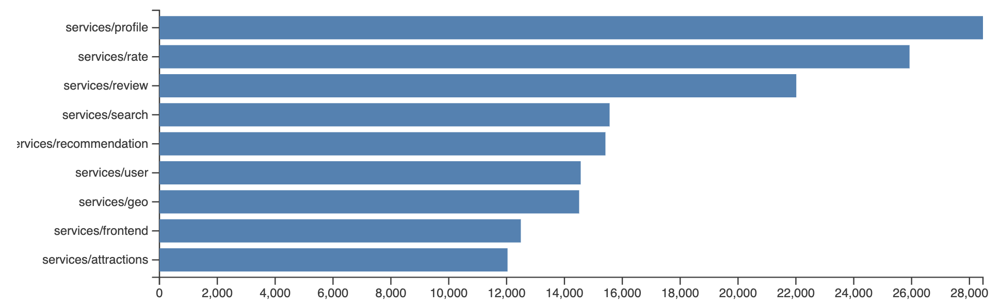
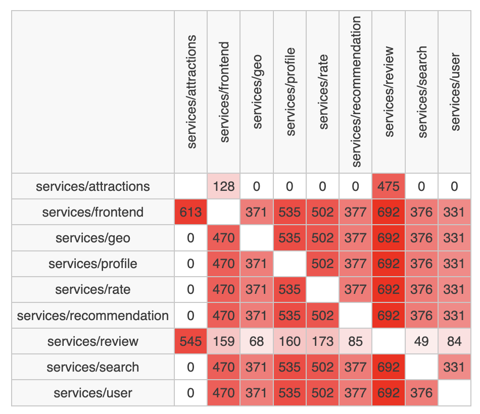
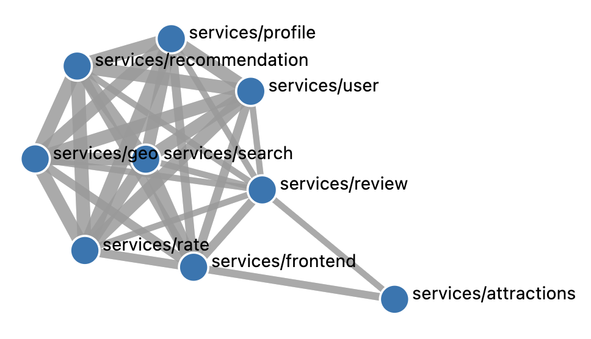

# git-microservice-analyzer

**git-microservice-analyzer** is a tool designed to analyze Git repositories to understand if the anti-pattern "Wrong Cuts" might be present in the repository.

The "Wrong Cuts" antipattern in microservice architecture refers to incorrectly splitting a system into microservices based on the wrong criteria, leading to poor cohesion, high coupling, and reduced maintainability. It typically happens when teams decompose the system by technical layers (e.g., frontend, backend, database) or organizational structure, rather than by business capabilities.

## Features

* Analyze the commit history of GIT repositories
* When different microservices are commited together, visualize:
   * a bar chart showing the total number of changed lines per microservice;
   * a matrix showing the total number of changed lines in pairs; and
   * a network diagram showing the total number of changed lines in pairs expressed as lines between microservices.
* Warn developers in the Source Control view if they are about to commit files belonging to different microservices

## Getting Started

### Prerequisites

* Visual Studio Code (https://code.visualstudio.com)

### Build

1. Clone the repository:

   ```bash
   git clone https://github.com/ajanes/git-microservice-analyzer.git
   cd git-microservice-analyzer
   ```

2. Install dependencies and create vsix file:

   ```bash
   npm install
   npm install -g @vscode/vsce
   vsce package
   ```

### Install

1. Install the dependency within Visual Studio Code:


   ```
   code --install-extension git-microservice-analyzer-0.1.0.vsix
   ```

### Usage

Within Visual Studio Code, display the Command Palette and use one of the following commands to obtain the diagrams described above:

* GIT Microservice Analyzer: Show co-committed folders
* GIT Microservice Analyzer: Show co-commits as matrix 
* GIT Microservice Analyzer: Show co-commits as chart 

## Configuration

Each project that wants to use GIT Microservice Analyzer needs to have a folder .vscode in its main folder containing a settings.json. An example of such configuration file is given below:

```
{
    "gitMicroservicesAnalyzer.microserviceFolders": [
        {"path": "services/service1"},
        {"path": "services/service2"},
        {"path": "services/service3"}
    ],
    "gitMicroservicesAnalyzer.startTime": "2000-01-01T00:00:00"
}
```

The example file above specifies three microservice folders: services/service1, services/service2, and services/service3. Only commits modifying files in these folders are considered. To exclude old commits, a startTime can be specified following the format "YYYY-MM-DDTHH:MM:SS". 

## Output

Examples of the output are as follows, calculated on the Open-source benchmark suite for cloud microservices https://github.com/delimitrou/DeathStarBench (the Hotel Reservation part).

The first diagram shows the sum of number of lines modified per service when such a service was co-commited with other services. It shows the gravity of the problem, in this case that profile was very often co-commited with other services. 



This diagram shows the number of sum of number of lines modified in each service pair, when co-commited together.  


This diagram visualized the matrix above using a network diagram.


## License

This project is licensed under the MIT License. See the [LICENSE](LICENSE) file for details.
